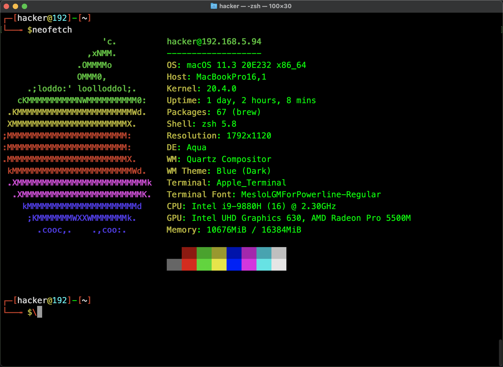

# Parrot Zsh Config
习惯了`parrot`的终端效果，但是`parrot`的终端shell是`bash`，而实际上`bash`无法提供一些比较实际的功能，所以趁着`5.1`分析了`parrot`的`bash`样式移植到了'zsh'上
* 命令高亮
* 根据历史命令补全
* 终端代理一键设置(开启是on，关闭是down)
* 还有一些乱七八糟的插件，很实用

## 效果


## 安装oh-my-zsh
请确保已安装curl

```bash
sh -c "$(curl -fsSL https://raw.githubusercontent.com/robbyrussell/oh-my-zsh/master/tools/install.sh)"
```

# 安装
```bash
cd ~ && cd ParrotZshConfig && source installantigen.zshrc && mv parrot.zshrc ~/.zshrc && source ~/.zshrc
```
