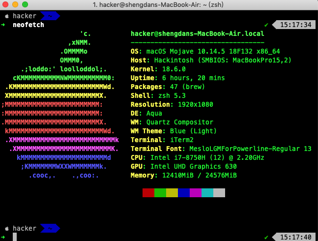

# Mac Terminal .zshrc
## 效果



## 安装oh-my-zsh
请确保已安装curl    

```bash  
sh -c "$(curl -fsSL https://raw.githubusercontent.com/robbyrussell/oh-my-zsh/master/tools/install.sh)"
```

# 安装antigen
* 请使用  Meslo LG M Regular for Powerline字体
```bash
cd ~ && git clone https://github.com/CooChristmas/MacTerminalzsh.git && cd MacTerminalzsh && mv 安装antigen.zshrc ~/.zshrc && zsh
```
# 使用
安装完成后 请执行

```bash
cd && cd MacTerminalzsh && mv .zshrc ~/.zshrc
```
